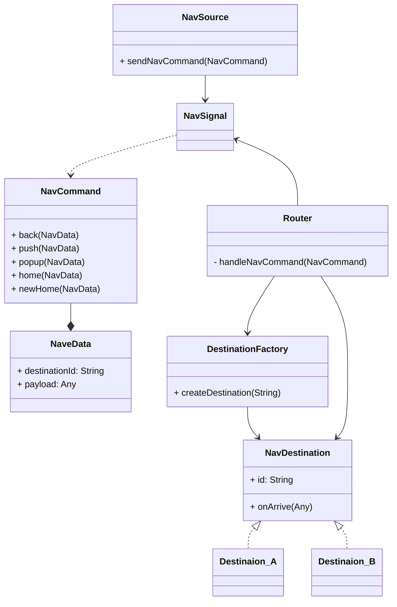

## Screenshots
| Normal | Empty |  Error |
|------------|-------------|-------------|  
||||

## Build tools & versions used
 - Xcode 13.4.1
 - Swift 5.6.1

## Steps to run the app
 1. Open `Directory.xcodeproj` with Xcode
 2. Get external package dependencies by `Xcode -> File -> Packages -> Resolve Package Versions`
 3. Choose your target simulator
 4. Build and run

## What areas of the app did you focus on?
 1. The overall architecture (MVVM)
 2. The navigation framework (A NavCommand-driven solution)
 3. The dependency injection (Swinject)

## What was the reason for your focus? What problems were you trying to solve?

Nowadays, the only thing unchanged for mobile app is change itself. So i mainly focused on the 3 areas to solve the problems of maintainability, extensibility, flexibility by following the SOLID principle.

### The overall architecture (MVVM)

The key to the Single Response Principle is to separate/group the concerns into layers. There are many patterns to achieve this, such a MVP, MVI, MVVM, VIPER, etc. In my opinion. MVVM is a good enough solution to cover most projects, and also not an overkill (which means, codes are easy to understand, call hierarchy are easy to flow, etc.). The following diagram is my MVVM-based architecture for the Directory app.

 ```mermaid
graph TB
 subgraph Navigation
	 Router
 end
 subgraph Flow
	 Navigator
	 ViewController
	 ViewModel
	 Repository
	 Navigator .-> ViewController
	 ViewController --> ViewModel
	 ViewModel .-> Navigator
	 ViewModel --> Repository
 end  
 subgraph  Service
    Http
    Cache[Cache]
    Storage[Storage]
 end  
 subgraph Backend
 CDN
 ApiServer
 end 
 Router -. NaviCommand .- Navigator
 Repository -- Api --> Http
 Repository --> Cache
 Repository --> Storage
 Http .-> CDN
 Http .-> ApiServer
```

### The navigation framework

Navigation is an underestimated problem for today's complex apps, especially when notification and deep link come into the picture. Usually, Coordinators come with a MVVM architecture to facilitate the app navigation. By working with this pattern for years, I found several downsides:

 1. Tight coupling: One flow's coordinator has to refer to all its target coordinators. This actually build a tight coupling between different flows. Because each coordinator belongs to its own flow, accessing its coordinator is actually creating a dependency to that flow.
 2. Messy control: The UIWindow and root view (like, ContainerViewController or UINavigationController) are passed down to each coordinator, so that anyone could change the view which is for sure to end with a chaos.
 3. Cannot handle non-linear navigation: The UI transition is not always `self --> next screen`. Situation like login expiration requires app to jump to login page from anywhere, and the same for notification click and deep link. 
 4. Violation of SRP: Each coordinator not only provide its own flow's view, but also changing the entire app's view hierarchy (like pushing it's flows view into UINavigationController, or replacing the root view of UIWindow to its own view). This also exposes the app's navigation choice to each coordinator. If we decide to change the app's navigation infrastructure, we'll have to change all the coordinators!

By taking a close look at all app's navigation behavior, I notice using an app is like using a web browser. They are both single page containers. So, no matter where you are, the navigation behaviors you could do are only these 5: 

- go back (browser back button)
- go to next page (click a link)
- show a pop up page (popup on current webpage)
- go to home page (home button/link click)
- go to a new home page (enter a new URL in web browser)

Based on the above thought, I "invented" a NavCommand-driven navigation framework.



The navigation is done in the follow steps:

1. A NavSource sends a NavCommand including a NavData, which has the destination id and payload for the NavDestination
2. The Router receives this NavCommand and ask for DestinationFactory (which is done with DI in my codes) to create the NavDestination for the destination id
3. Router calls the NavDestination.onArrive(Any) to pass the payload to NavDestination, and also NavDestination returns the UIViewController to the Router
4. The Router place this UIViewController into the view hierarchy based on the NavCommand type.

In this framework, NavSource (can by anywhere in the codes), NavDestination (usually a flow's entry point) and Router are only connected with a NavSignal which carries NavCommand. There's no direct dependency between each other, and the Router's implementation is hidden. You can change Router's implementation without affecting any existing flows/screens and vice versa.

### The dependency injection

The decouple each module and make the code testable, dependency injection must come into the picture. In my implementation, each concrete class conforms to a certain protocol. Each class' dependencies are protocols instead of the concrete classes. The DI implement (by the help of Swinject) is responsible for hiding the construction of each concrete class and providing them through the protocol. The benefit:

1. Loosing coupling: The agreements between each module is the protocol. We can change the implementation of concrete class and provide them through DI without breaking its depending modules.
2. Test driven: It's easy to mock a class's dependency during test to simulate different scenarios. Check my tests implementation to see how easy it is to achieve 99.x% coverage rage :)
 
## How long did you spend on this project?

Totally 10 Hours. 
- Spent more time than I thought on experimenting my new idea of navigation.
- Spend event more time on writing this README.

## Did you make any trade-offs for this project? What would you have done differently with more time?

 1. HttpService layer is implemented as a simple wrapper of URLSession. If I got more time, I'd like to add request queue and QoS to better support upper layer's future requirements like prioritizing requests, background fetch, retry, limit of concurrent requests, etc.
 2. The Kingfisher is good at handling remote image, but I would like to do it by my self if I got more time. With my own caching, I could have a unified eviction policy and total cache size control across the app. Also, with the "better" HttpServer layer mention in #1, I could de-prioritize imaging downloading requests and save CPU/bandwidth for other more important tasks first.
 3. The navigation framework still needs to answer two more key real-life problems
	 * If a new destination is already in the navigation stack, what should we do? Push a new instance on the top of the stack, or pop the stack to the existing instance of the destination? 
	 * When popping an existing screen, is dismissing that screen OK? The user might be in the middle of some flow. We'd better provide a mechanism to confirm if current view is admissible.
	 
## What do you think is the weakest part of your project?

How to handle the MVVM downsides when the app expands. For example, code reusability. Because view and view model are 1:1 mapping in MVVM, it's difficult reuse their logic. One attempt was made to extract the command table view logic into BaseTableViewData, BaseTableViewCell and BaseTableViewCellViewModel.

I also wish to discuss, if I have a chance, with Square/Block engineer in the on-site interview to find more weakest parts in my project and learn the ways of improvement.

## Did you copy any code or dependencies? Please make sure to attribute them here!

The following 3rd-party libraries are imported via Swift Package Manager
- Swinject 2.8.1 -> for dependency injection
- Kingfisher 7.3.0 -> for remote image loading and caching

## Is there any other information you’d like us to know?

The app randomly chooses one of the three APIs to fetch data. So, keep "pulling to refresh" and you'll see the three scenarios: directory with employees screen, empty directory screen and fetch failure screen.

> PS1: There's a tiny advertisement for myself on the empty directory screen LOL
> 
> PS2: UI is not my strongest part, so I've done all my best for the looks and feels of the app.
